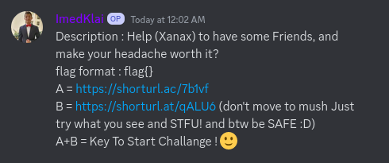
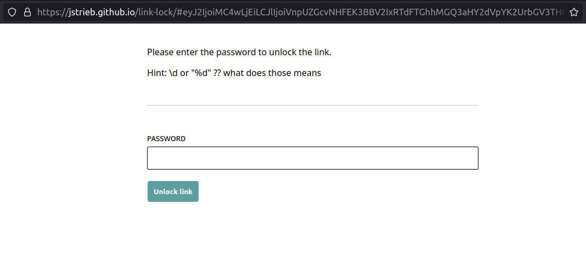
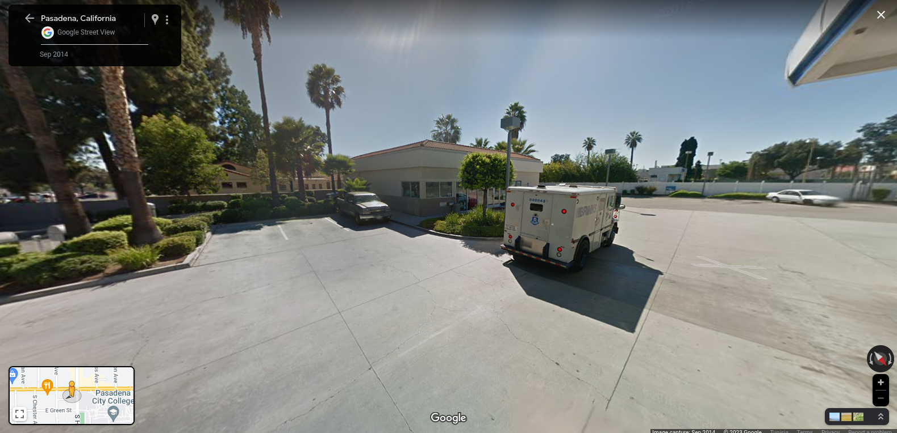

# Headache Extravaganza (local discord challenge)

## discription :
a misc challenge that have been hosted on our local discord server.<br>
it's a mics of cryptography & OSINT and other stuff in general.<br>
it requires a little of knowledge in some cryptography types and a lot of thinking 
<br>
<br>
the challenge have only one flag but you get it in 3 parts let's see how 
## first part of flag :
let's take a look at the callenge description : 
<br><br>

<br>
<br>
here we get who links one named A and the other named B, and after that it says A + B is the key to start the challenge <br>
so that means that the two links are linked to each other to solve the challenge <br>
lets visit the first one and see what we got :
<br>
<br>

<br>
<br>
here we can see that we are looking for a password to unlock some link 
<br>
<br>
now lets see the other link :
<br>
<br>

<br>
<br>
here we get some place in google maps but if we look closely there is a code on the truck :
<br>
<br>

<br>
<br>
and if put that code in first website it will unlock and pass us to the next website :
<br>
<br>

<br>
<br>
we get a screenshot of a room in our discord server, let's see what's in there :
<br>
<br>

<br>
<br>
we got so many encrypted stuff, let's go to cyebrchef and start decrypting this. <br>
the first one is the channel name, it's a rot13 encryption, you can learn more about it in [here](https://en.wikipedia.org/wiki/ROT13)
<br>
<br>

<br>
<br>
it's useless but now let's get into the middle part 
<br>
```
domain.toplvldomain/watch?v=M-R0YhVRYto
Rkrk! myzid g 7kdsdrk uswk roik vyv wk3knmr d5kwow lkuk ov
lvkcck zvc hn k9bk g jk3wk omr sxktow suyex kdrouk,
dkg g7ovod ps odrs -_- g xogs duwv (nrobs dkg hn)!
```
<br>
as we can se we have two parts the first one we have a like link we will se itt late but for now we will decrypt the second part 
<br>
we can do that through bruteforce the rot13 amount 
<br>
<br>

<br>
<br>
as we can see in here it's a rot13 with 16 amount, obviously we know that because it's the only one readable in there. <br>
you can decrypt on your own and see the full message but it's kinda useless, let's go back and take a look at the url provided 


